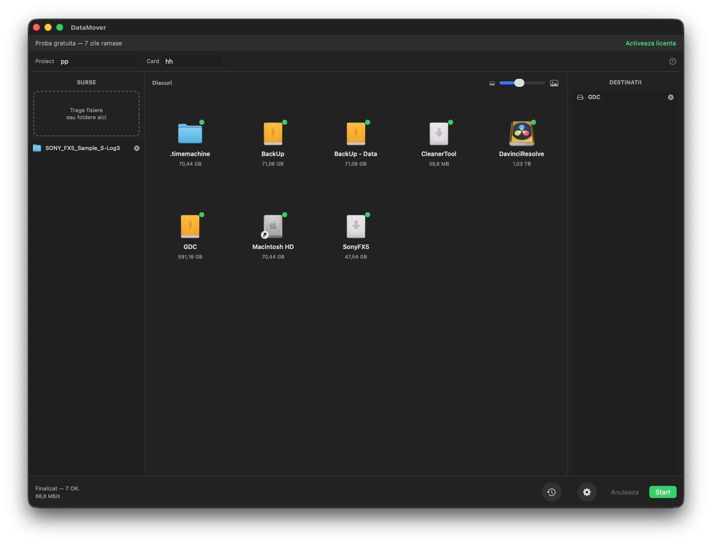
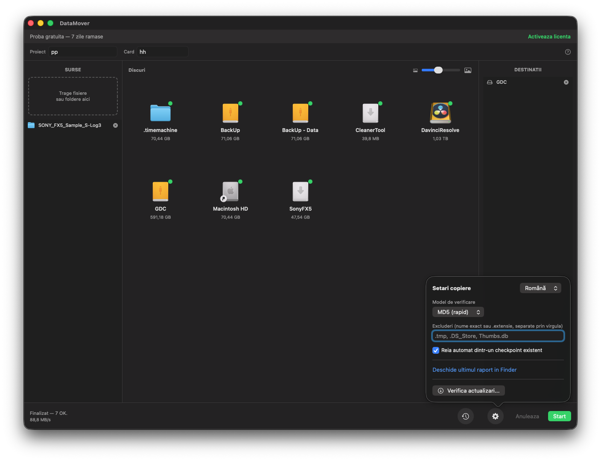
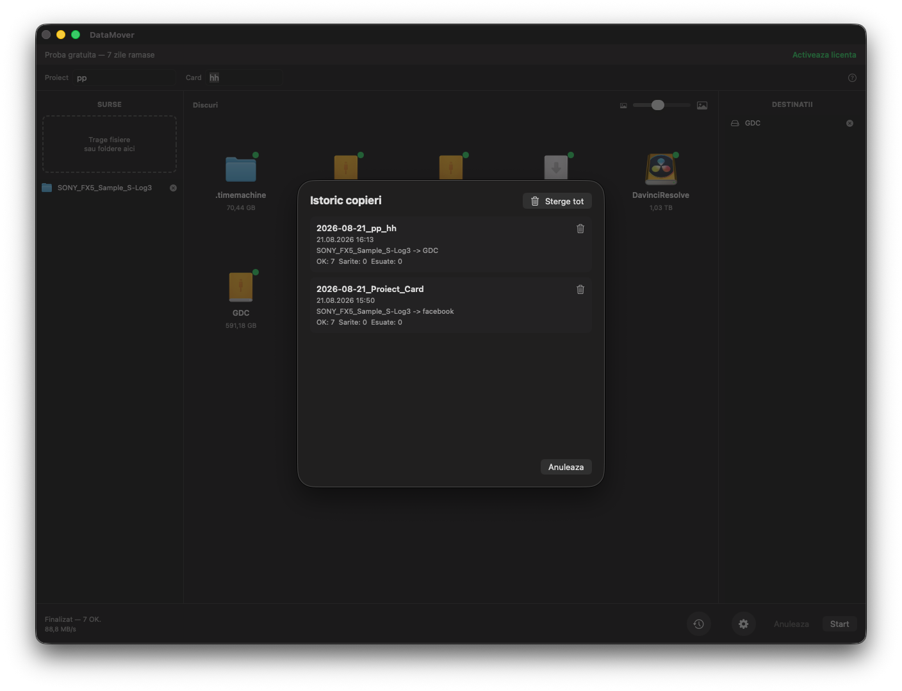
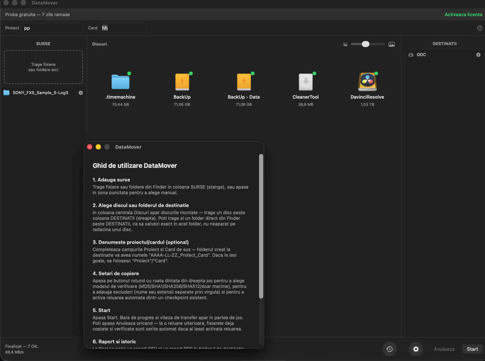

# DataMover

[Romanian](README.md) | [English](README.en.md) | [Spanish](README.es.md)

**Verified offload for video production teams**

## Screenshots

Native macOS UI (SwiftUI) — sources, disks and destinations in a single 3-column layout.

| Main window | Copy settings |
|-------------|---------------|
|  |  |

| Copy history | Built-in user guide |
|--------------|----------------------|
|  |  |

## Features

- Simultaneous copy to any number of destinations (external drives, NAS, local folders)
- Integrity verification, your choice: MD5, SHA-1, SHA-256, SHA-512, or size-only
- Dark theme
- CSV + PDF reports (table layout), with per-file status (OK / Mismatch / Error) and exact timestamp
- Automatic resume on errors (checkpoint) — continues from where it left off
- Copy history — view and delete individual or all entries (Mac)
- Monitor Mode in the system tray — automatically detects inserted cards (Windows)
- Per-destination progress bars, with current speed (MB/s) and quick folder access
- Built-in user guide
- Keyboard shortcuts for the main actions
- Centralized log for long-term auditing
- Parallel copy — all destinations complete simultaneously
- Automatic folder naming: `Date_Project_Card`
- Full localization RO/EN/ES
- Support for macOS (native SwiftUI UI, Apple Silicon + Intel) and Windows 10/11
- Customizable exclusions — files or extensions

## Download

Download the latest version from [Releases](https://github.com/gordasgdc/datamover/releases).

| Platform | File | Description |
|----------|------|-------------|
| Mac | `DataMover-<version>.dmg` (and `DataMover.dmg`, stable name) | Developer ID signed, Apple-notarized disk image: contains the `DataMover-<version>.pkg` installer and the PDF guide |
| Windows | `DataMover-WPF-Windows.zip` | `DataMoverSetup.exe` installer for the Windows app (WPF) |

## Quick install

### Mac
1. Download `DataMover-<version>.dmg` and open it
2. Double-click `DataMover-<version>.pkg` — the installer puts the app straight into `/Applications` (no Gatekeeper warning: the package is notarized)

### Windows
1. Download `DataMover-WPF-Windows.zip` and extract the contents
2. Run `DataMoverSetup.exe` (installs the app into Program Files, with shortcuts)
3. If SmartScreen warns, click "More info" → "Run anyway" (the Windows build does not have a commercial signature yet)

## Full documentation

See [CITESTE-MA.md](CITESTE-MA.md) (Romanian only for now) for detailed install, build, release, and troubleshooting instructions.

## Author

**Cristi Gordas** ([@gordasgdc](https://github.com/gordasgdc))

Contact and links are available directly in the app, in the "Activate license" window.

## License

This project is distributed under the [MIT License](LICENSE).
