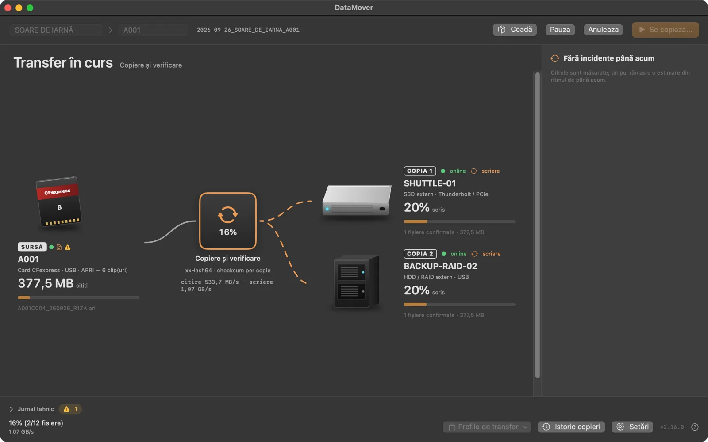
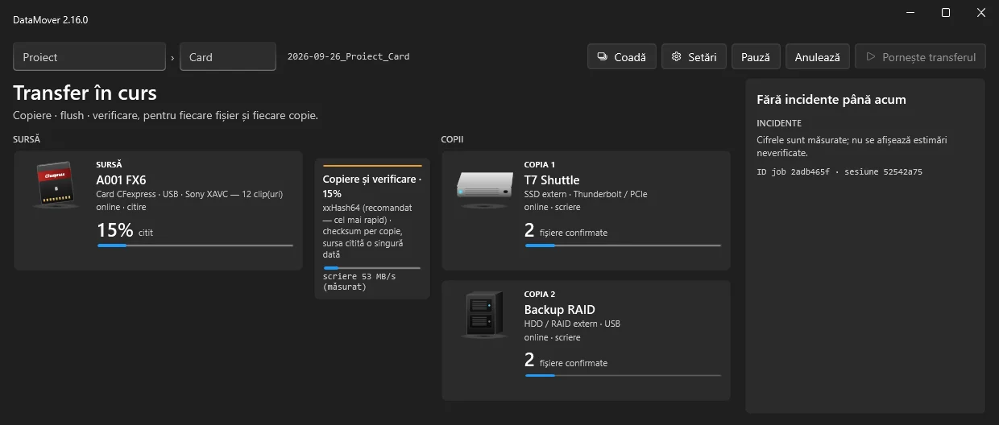

# DataMover

Verified offload for video production: the card is read once, and the footage is
copied to several independent drives at the same time. Each file gets its final
name only after the copy's checksum matches the source.

**Download and overview: [gordas.dev/datamover](https://gordas.dev/datamover/)** · current version **2.17.1**

## What it does

- Reads the source once and writes to every destination in parallel (external drives, RAID, NAS, folders).
- Copy contract for every file and every copy: write → flush to disk → read back and verify. An unverified file never appears under its final name.
- xxHash64 verification by default; MD5, SHA-1, SHA-256 or SHA-512 on request.
- Resume after an interruption: files already confirmed are not copied again, incomplete ones are cleaned up.
- Delivery reports for each destination: PDF, HTML, CSV and MHL, with a verdict (verified, with warnings, unconfirmed, cancelled).
- Romanian, English and Spanish interface, on macOS and Windows.

## Platforms and requirements

- **macOS 14 or later, Apple Silicon.** Package signed with Developer ID and notarized by Apple.
- **Windows 11, 64-bit (x64).** On Windows 11 ARM64 it runs under the system's x64 emulation.

## Installation

**macOS.** Download `DataMover.dmg` from [gordas.dev/datamover](https://gordas.dev/datamover/), open it and run the `.pkg` installer. The app is installed in `/Applications`.

**Windows.** Download `DataMover-WPF-Windows.zip`, extract it and run `DataMoverSetup.exe`. The app is installed in Program Files, with shortcuts.

> The Windows installer currently carries a self-signed signature, not a commercial Authenticode certificate. SmartScreen may show “Windows protected your PC” or “Unknown publisher”. If you downloaded the file from gordas.dev, choose **More info → Run anyway**.

## Trial and activation

- 7 days fully functional, no account needed.
- Without activation, after the trial each transfer is limited to 2 GB.
- Activation uses a personal code tied to the computer ID, obtained through a donation to development. Details in the app and on [gordas.dev/datamover](https://gordas.dev/datamover/).

## Diagnostics

The technical log stays local on your computer; nothing is sent automatically. For support, the app can create a diagnostic export with paths and personal data redacted, which you send only if you choose to.

## For developers

- [CITESTE-MA.md](CITESTE-MA.md) — building, publishing, troubleshooting (Romanian)
- [ARCHITECTURE.md](ARCHITECTURE.md) · [RELIABILITY.md](RELIABILITY.md) · [CHANGELOG.md](CHANGELOG.md)
- [support/JURNALE_SI_DIAGNOSTIC.md](support/JURNALE_SI_DIAGNOSTIC.md)

Language: [Română](README.md) · **English** · [Español](README.es.md)

## License

Source code under the [MIT license](LICENSE). Author: Cristi Gordaș.
