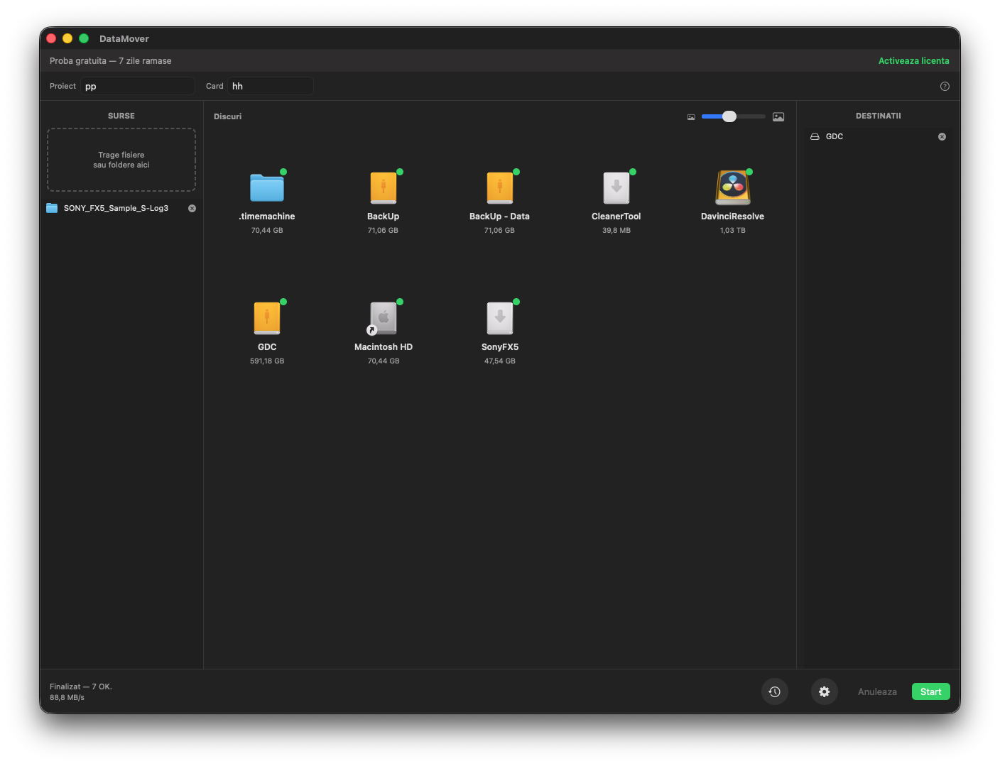
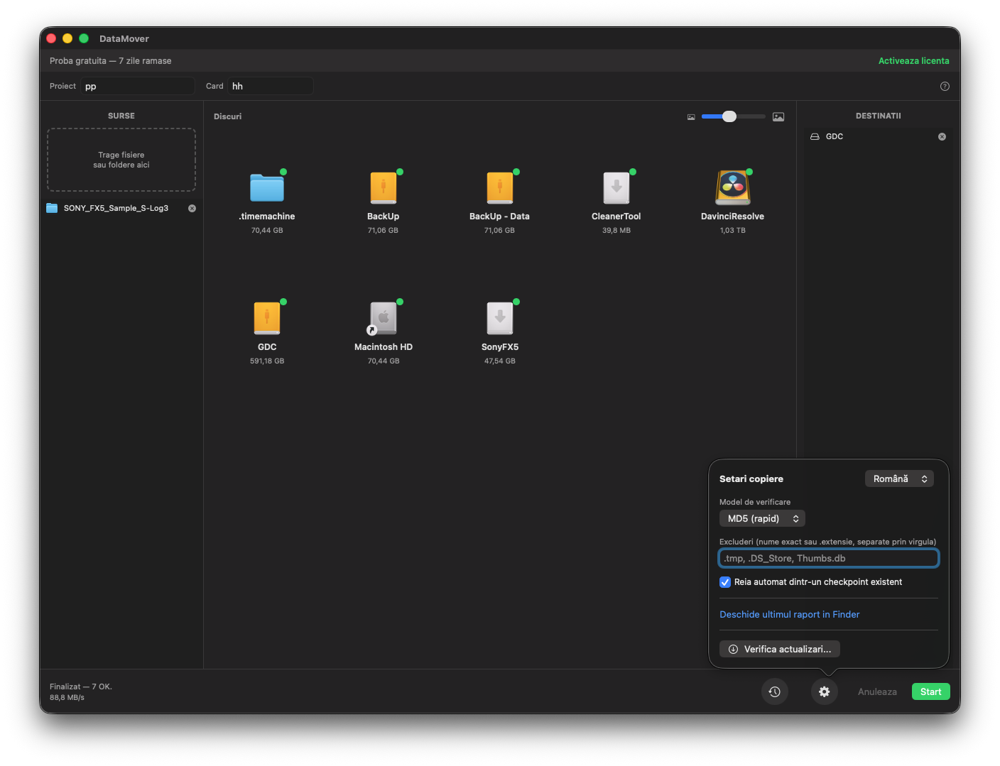
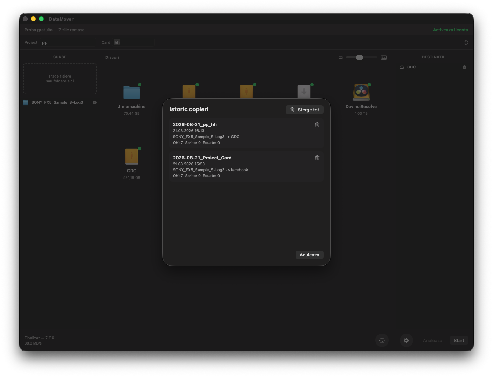
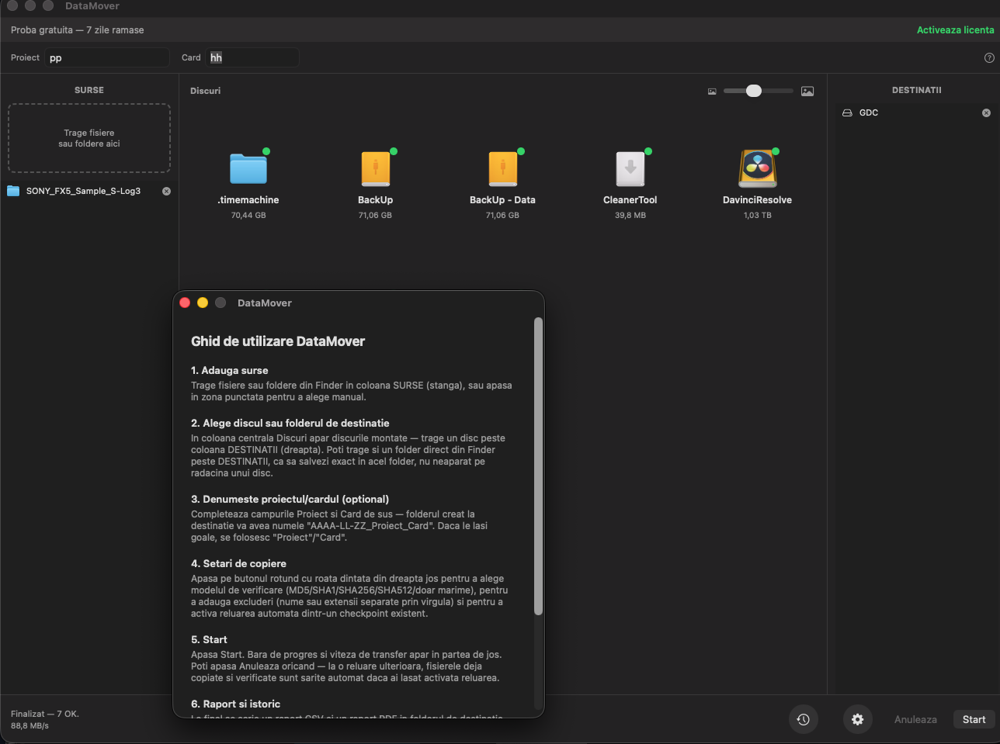

# DataMover

[Română](README.md) | [English](README.en.md) | [Español](README.es.md)

**Offload verificat pentru echipele de producție video**

## Capturi de ecran

UI nativ macOS (SwiftUI) — surse, discuri și destinații într-un singur layout pe 3 coloane.

| Fereastra principală | Setări de copiere |
|-----------------------|--------------------|
|  |  |

| Istoric copieri | Ghid de utilizare integrat |
|------------------|------------------------------|
|  |  |

## Funcționalități

- Copiere simultană către oricâte destinații (drive-uri externe, NAS, foldere locale)
- Verificare integritate la alegere: MD5, SHA-1, SHA-256, SHA-512 sau doar dimensiune
- Temă întunecată
- Rapoarte CSV + PDF (tabel), cu status per fișier (OK / Nepotrivire / Eroare) și timestamp exact
- Reluare automată la erori (checkpoint) — continuă de unde a rămas
- Istoric copieri — vizualizare și ștergere individuală sau completă (Mac)
- Mod Monitorizare în system tray — detectează automat cardurile introduse (Windows)
- Bare de progres per destinație, cu viteză curentă (MB/s) și deschidere rapidă a folderului
- Ghid de utilizare integrat
- Scurtături de tastatură pentru acțiunile principale
- Log centralizat pentru audit pe termen lung
- Copiere paralelă — toate destinațiile se completează simultan
- Denumire automată a folderelor: `Data_Proiect_Card`
- Localizare completă RO/EN/ES
- Suport pentru macOS (UI nativ SwiftUI, Apple Silicon + Intel) și Windows 10/11
- Excluderi personalizabile — fișiere sau extensii

## Download

Descarcă ultima versiune de la [Releases](https://github.com/gordasgdc/datamover/releases).

| Platformă | Fișier | Descriere |
|-----------|--------|-----------|
| Mac | `DataMover-Mac.zip` | `DataMover.app` nativ (SwiftUI) + ghidurile PDF (RO/EN/ES) |
| Windows | `DataMover-Windows.zip` | `DataMover.exe` + ghidurile PDF (RO/EN/ES) |

## Instalare rapidă

### Mac
1. Descarcă `DataMover-Mac.zip` și extrage
2. Mută `DataMover.app` în `/Applications`
3. La prima rulare, click-dreapta pe aplicație → `Open` → confirmă (o singură dată; aplicația e semnată ad-hoc, fără cont Apple Developer plătit)

### Windows
1. Descarcă `DataMover-Windows.zip` și extrage conținutul
2. Rulează `DataMover.exe`
3. Dacă SmartScreen avertizează, apasă „More info” → „Run anyway”

## Documentație completă

Vezi [CITESTE-MA.md](CITESTE-MA.md) pentru instrucțiuni detaliate de instalare, compilare, publicare de versiuni noi și depanare.

## Autor

**Cristi Gordas** ([@gordasgdc](https://github.com/gordasgdc))

Contact și link-uri disponibile direct din aplicație, în fereastra „Activează licența”.

## Licență

Acest proiect este distribuit sub [Licența MIT](LICENSE).
